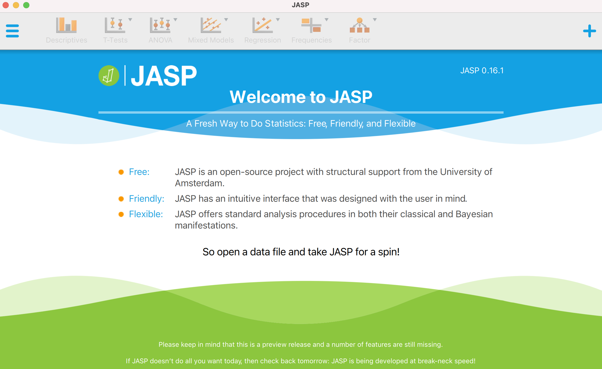
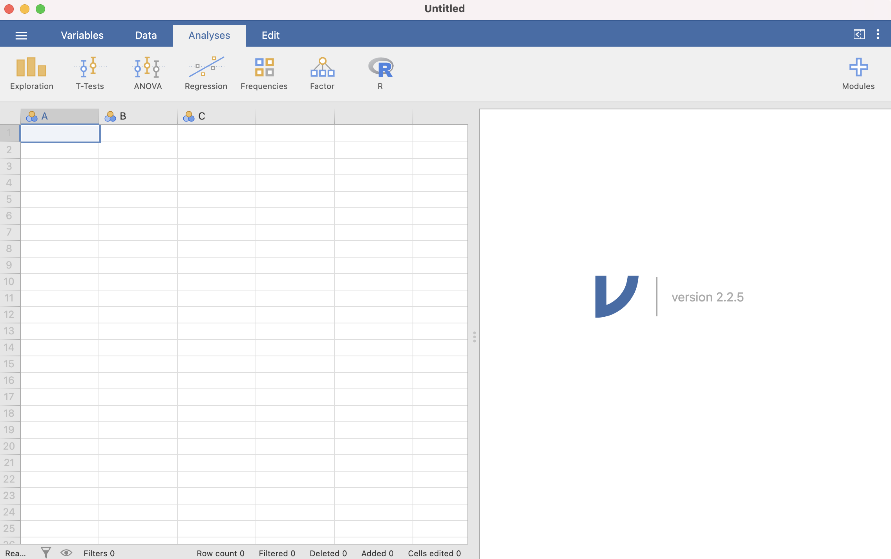
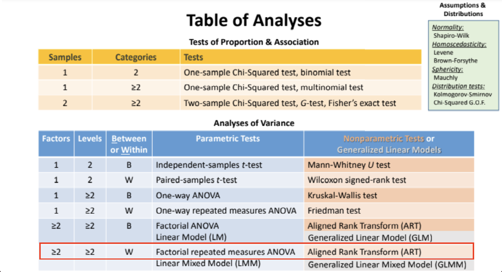

## What is jamovi?

- jamovi is a **free**, **open-source** software that offers a point-and-click interface (GUI) for **R**. It was started by developers who worked on JASP.

- jamovi is built on top of R, and all the analyses it provides are written in R, and it could enter R code directly.


## Why we need jamovi?



- JASP can not perform ART (Aligned Rank Transform)
- [ARTool](https://depts.washington.edu/acelab/proj/art/) only support Windows version and R version
- JASP has not been possible to enter R code directly or easily add custom plugin/module

## Our needs
- Complete all of the data analysis using one tool/language easily.{.fragment .fade-in-then-semi-out"}
- This tool has the similar GUI operation to the JASP for quick drawing of graphics.{.fragment .fade-in-then-semi-out"}
- It also supports custom plugins/modules for flexible expansion.{.fragment .fade-in-then-semi-out"}


## How to use jamovi and R together?

There are **two** ways to use jamovi and R together.
- Use of the **Rj Editor** in jamovi
- Use the **jmv** R package in RStudio

jamovi can also provide the equivalent R syntax for each analysis with **Syntax mode**.


## How to use Rj Editor in jamovi

## Installation
<image src="./images/2022-03-20-23-54-34.png" height=500/>

## Enter Code
<image src="./images/2022-03-20-23-56-57.png" height=500/>
<aside class="notes">Rj auto-suggests function names, like in RStudio.</aside>

By default, [Rj](https://blog.jamovi.org/2018/07/30/rj.html) makes use of the version of R bundled with jamovi. This includes many packages.

But if you need to make use of additional R packages then you’ll need to make use of the System R version.
<aside class="notes">If you select the configuration gear to the top right of the code box, you’ll see an option to change the R version used.</aside>

<image src="./images/2022-03-21-00-08-23.png" height=500/>
<aside class="notes">The System R uses the version of R you have installed. It has access to all of the packages you have installed for that version of R. The last thing you will need is to have the jmvconnect R package installed in your system R library.</aside>

## ART Demo

#### Install packages from R terminal or RStudio

````R
# It allows system R version to access the jamovi datasets.
install.packages('jmvconnect')

# download and install the ARTool package
install.packages("ARTool")
````

<image src="./images/2022-03-21-00-11-08.png" height=500/>


## How to use jamovi in RStudio

#### Install jmv from R terminal or RStudio
````R
# jmv is the jamovi R package.
install.packages('jmv')
````

- All the analyses included with jamovi are available from within R using this package.
- For examples on how to use [jmv](https://www.jamovi.org/jmv/), jamovi can be placed in 'syntax mode'.
- Syntax mode produces the R syntax required to reproduce jamovi analyses in R.

<image src="./images/2022-03-21-00-36-06.png" height=500/>

<image src="./images/2022-03-21-00-36-46.png" height=500/>

<image src="./images/2022-03-21-00-39-34.png" height=600/>

<image src="./images/2022-03-21-00-50-01.png" height=600/>

<image src="./images/2022-03-21-00-51-13.png" height=500/>

## Other useful features
- import multiple files
- export template
- custom modules/plugins
- variable transformations
- learn R stats

## Learning Resources
- Video tutorials from [datalab.cc](https://datalab.cc/jamovi/) (also through [YouTube](https://www.youtube.com/watch?v=mZomeS0tLxY))
- [Learning Statistics with jamovi](https://www.learnstatswithjamovi.com/): A tutorial for psychology students and other beginners